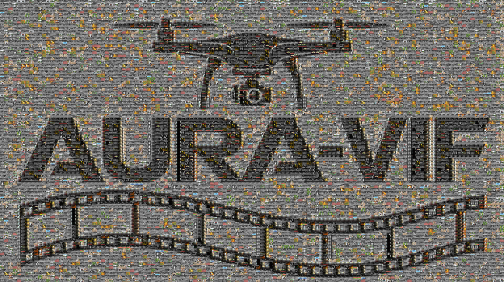
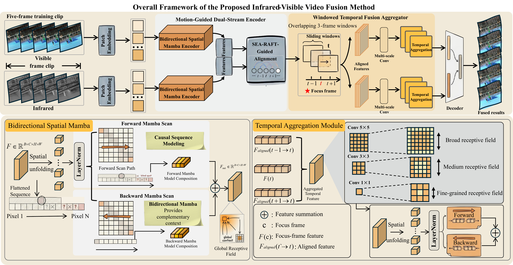
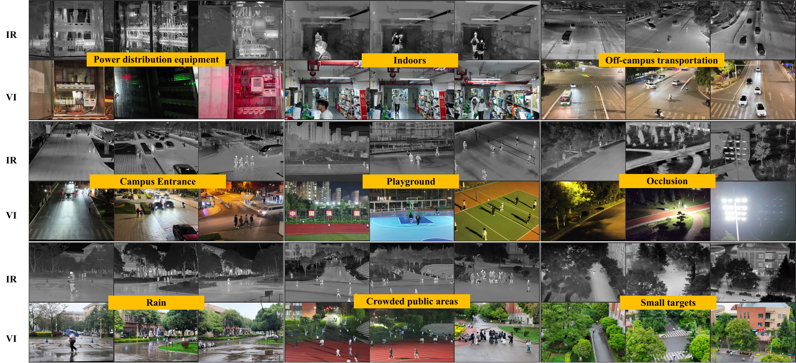

# AURA-VIF

### Low-Altitude UAV Infrared-Visible Video Fusion

  
  
  

  <a href="#mastfusion">MASTFusion</a> &nbsp;|&nbsp;
  <a href="#video-demos">Video demos</a> &nbsp;|&nbsp;
  <a href="#scene-coverage">Scene coverage</a> &nbsp;|&nbsp;

## MASTFusion

  

| Module | Purpose |
| --- | --- |
| **MDSE** | Modality-specific patch embedding and Bidirectional Spatial Mamba encoding, followed by frozen SEA-RAFT alignment. |
| **WTFA** | Independent infrared and visible aggregation over overlapping three-frame windows with multi-scale convolution and Bi-Mamba refinement. |
| **Fusion decoder** | Delayed cross-modal concatenation, Transformer reconstruction, and fused-frame output. |

During training, a five-frame clip produces three consecutive outputs from overlapping three-frame windows centered at `t-1`, `t`, and `t+1`.

## Video demos

These clips visualize synchronized infrared-visible frames by overlaying the two registered streams. They are registration visualizations, not fusion-algorithm outputs.

### Demo 1

https://github.com/user-attachments/assets/79e1dfef-b6e9-4ec8-86d1-fbd55783948a

### Demo 3

https://github.com/user-attachments/assets/4817d2c8-c885-4328-8ce6-bf1445f1cb84

## Scene coverage

The collection includes roads, campus entrances, playgrounds, crowded public areas, transportation zones, power-distribution facilities, indoor scenes, rain, small targets, and partial occlusion.

  

